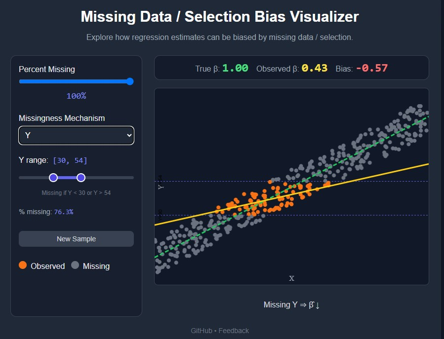

# Missing-Data / Selection-Bias Visualizer
Interactive one-page demo that **shows, in real time, how different missing-data mechanisms could bias regression**.  
Move the sliders, watch β̂ diverge from the truth, and build intuition about MCAR vs MNAR in seconds.

**▶️ [Live demo](https://dbann.github.io/selection/)**

## Features
- **Percent-missing slider** plus presets for MCAR, MNAR-by-X, MNAR-by-Y, `X ∨ Y`, *Flatten* and *Steepen*.
- Live read-outs of **βtrue**, **β̂**, and a colour-coded bias gauge.
- One-click **resample** to illustrate sampling variability.
- Single HTML file 

## License
MIT License - see the [LICENSE](LICENSE) file for details.

## Feedback
david.bann@ucl.ac.uk 